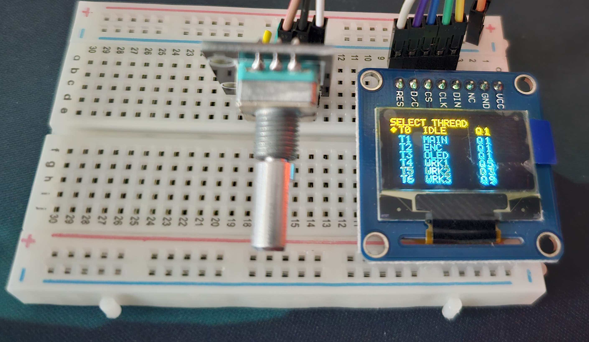
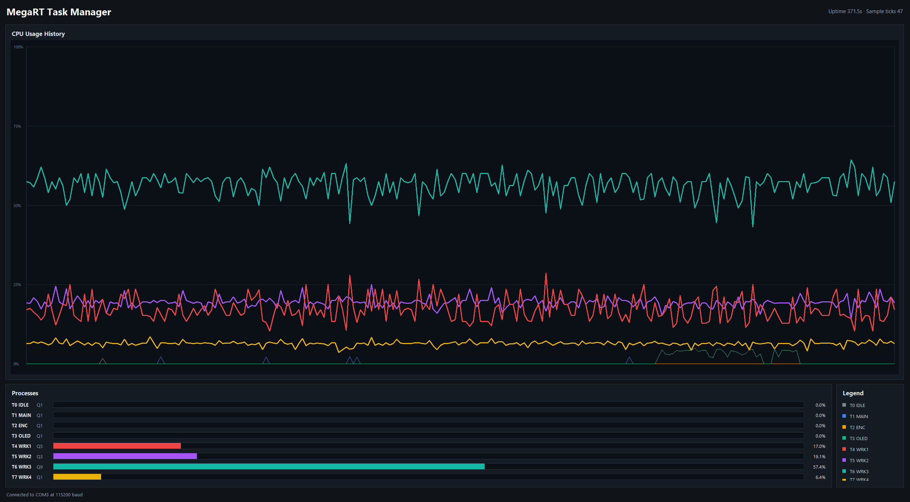

# athreads

athreads is a small C/AVR assembly library for preemptive scheduling on 8-bit
AVR microcontrollers, developed and demonstrated on the ATmega2560.

`athreads` provides timer-driven context switching, per-thread time quanta,
explicit stack management, sleeping threads, and lightweight CPU accounting.
Optional profiling and hardware UI modules are included to inspect scheduler
behavior on a real board, but the main project is the scheduler library itself.




## Core Library

The main component is the `athreads` scheduler:

- Preemptive round-robin scheduling on ATmega2560.
- AVR assembly context switching for register and stack preservation.
- Timer1-based scheduler interrupt and quantum accounting.
- Independent quantum value per thread.
- Runtime quantum updates through the scheduler API.
- Thread states: ready, running, blocked, sleeping, and zombie.
- Cooperative sleep support with tick-based wakeups.
- Per-thread CPU tick accounting for profiling and visualization.

The scheduler is intentionally small and direct. It is meant to expose how a
preemptive runtime works close to the metal: stack setup, interrupt-driven
switching, register save/restore, scheduling policy, and runtime measurement.

## Project Structure

```text
include/
  athread/      Public scheduler API and generated AVR structure offsets
  platform/     USART, uptime, and debug headers
  profiling/    CPU statistics, tracing, and worker demo headers
  ui/           OLED and encoder headers

src/
  athread/      Scheduler implementation and AVR context switch assembly
  platform/     USART and millisecond uptime support
  profiling/    CPU sampling, trace hooks, and demo workloads
  ui/           SPI OLED driver and rotary encoder input
  main.c        Demo firmware entry point

tools/
  cpu_task_manager.py       Live CPU profiling viewer
  gen_offsets.py            PlatformIO pre-build offset generator
  gen_athread_offsets.c     Offset generator source
  run_cpu_task_manager.bat  Optional Windows launcher
```

## Build And Upload

Build the firmware with PlatformIO:

```powershell
pio run
```

Upload to the Arduino Mega 2560:

```powershell
pio run -t upload
```

Close any serial monitor or CPU viewer before uploading if the port is busy.

## Scheduler API

The scheduler API is exposed from `include/athread/athread.h`.

```c
void athread_init(void);
void athread_start(void);

uint8_t athread_create(athread_entry_t entry, void *info, uint16_t stack_size);

void athread_yield(void);
void athread_sleep_ticks(uint8_t ticks);

uint8_t athread_set_quantum(uint8_t tid, uint8_t quantum_ticks);
uint8_t athread_get_quantum(uint8_t tid);
uint8_t athread_get_thread_count(void);
uint8_t athread_get_cpu_ticks(uint32_t *out_ticks, uint8_t max_ticks);
uint8_t athread_get_current_tid(void);

void athread_tick(void);
void athread_bootstrap(void);
```

Most application code uses `athread_init()`, `athread_create()`,
`athread_start()`, `athread_yield()`, `athread_sleep_ticks()`, and the quantum
or profiling accessors. Each thread receives its stack from the scheduler stack
pool, and the caller chooses the stack size when creating the thread.
`athread_tick()` and `athread_bootstrap()` are exported runtime hooks used by
the platform timer and thread startup path.

| Function | Description |
| --- | --- |
| `athread_init()` | Initializes scheduler state, creates the idle thread, and prepares the timer/context-switching machinery. Call this before creating application threads. |
| `athread_start()` | Starts the scheduler and transfers execution to scheduled threads. This does not return during normal operation. |
| `athread_create(entry, info, stack_size)` | Allocates a thread slot, reserves `stack_size` bytes from the scheduler stack pool, initializes its stack/context, stores the entry function and argument pointer, and returns the new thread ID. Returns `ATHREAD_INVALID_TID` on failure. |
| `athread_yield()` | Voluntarily gives up the CPU and asks the scheduler to run another ready thread. Useful when a thread finishes a unit of work before its quantum expires. |
| `athread_sleep_ticks(ticks)` | Puts the current thread to sleep for a number of scheduler ticks. Sleeping threads do not consume CPU until their wake tick expires. |
| `athread_set_quantum(tid, quantum_ticks)` | Updates how many scheduler ticks a thread may run before preemption. Values below `ATHREAD_MIN_QUANTUM_TICKS` are clamped. |
| `athread_get_quantum(tid)` | Returns the configured quantum for a thread, or `0` if the thread ID is invalid or unused. |
| `athread_get_thread_count()` | Returns the number of allocated thread IDs, including the idle thread. |
| `athread_get_cpu_ticks(out_ticks, max_ticks)` | Copies cumulative CPU tick counters into `out_ticks` for profiling or diagnostics, up to `max_ticks` entries. Returns the number of counters copied. |
| `athread_get_current_tid()` | Returns the currently running thread ID. |
| `athread_tick()` | Advances scheduler time bookkeeping, including sleeping-thread wakeups. This is intended to be called from the platform timer tick. |
| `athread_bootstrap()` | Internal entry wrapper used when a thread starts for the first time. It calls the user entry function and handles thread exit state. |

Timer1 drives preemption and quantum expiration. Timer2 provides millisecond
uptime and the demo's encoder debouncing tick. The assembly context switcher
uses generated structure offsets from `include/athread/athread_offsets.h`.

## Optional Profiling Demo

The repository includes a profiling demo that uses `athreads` CPU counters to
make scheduler behavior visible on a PC:

- Firmware samples per-thread CPU counters.
- Samples are sent over USART as compact binary packets.
- `tools/cpu_task_manager.py` reads the serial stream.
- A Tkinter UI plots per-thread CPU usage live.

Run the viewer after uploading the firmware:

```powershell
python ./tools/cpu_task_manager.py --port COM3
```

Change `COM3` if the board appears on another port.

## Optional Hardware UI

The demo firmware can also show and modify scheduler state directly on the
board using an SPI OLED and rotary encoder. The OLED lists running threads, and
the encoder selects a thread and changes its quantum at runtime.

| Thread | Name | Purpose |
| --- | --- | --- |
| T0 | IDLE | Scheduler idle thread |
| T1 | MAIN | Application coordinator |
| T2 | ENC | Rotary encoder input |
| T3 | OLED | OLED process menu |
| T4 | WRK1 | Demo worker workload |
| T5 | WRK2 | Demo worker workload |
| T6 | WRK3 | Demo worker workload |
| T7 | WRK4 | Burstier demo worker workload |

## Generated Offsets

The AVR assembly code needs stable offsets into scheduler structures. These are
generated before compilation by:

```text
tools/gen_offsets.py
tools/gen_athread_offsets.c
```

The generated header is:

```text
include/athread/athread_offsets.h
```

## Notes

Some AVR warnings about `__builtin_return_address` can appear when function
instrumentation is enabled. They are expected for the profiling hooks used by
the demo.

## License

MIT License. See `LICENSE` for details.
